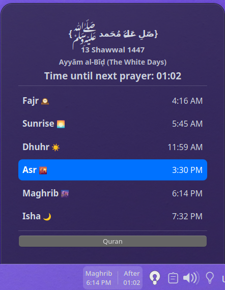
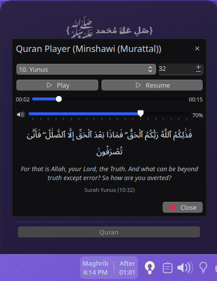
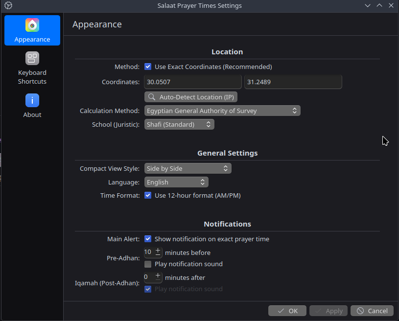
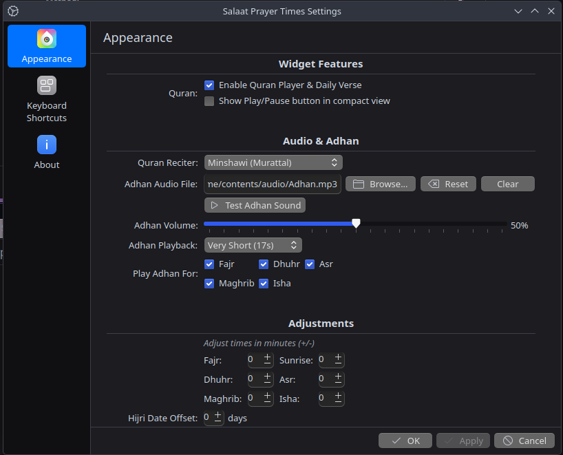

  # S Prayer Times(Quran and Adhan Player) for KDE Plasma

A simple and customizable widget for KDE Plasma 6 to display daily Islamic prayer times.
It features Hijri date, special Islamic occasion messages, configurable time offsets, adhan sound and a quran player.

Calculations are based on the [AlAdhan API](https://aladhan.com/prayer-times-api).
Quran api from [Quran API](https://alquran.cloud/api).

  

## Key Features
* Daily prayer times with customizable offsets.
* Hijri date display with manual adjustment.
* Special Islamic date notifications (e.g., Ramadan, Eid).
* Quran Player with many reciters
* English and Arabic language support.
* 12/24 hour format & prayer notifications.
* Custom Adhan sound support
* Time until next prayer countdown

## Installation
*Just download from [Kde Store](https://store.kde.org/p/2293509/). or clone this repository.

## Configuration
Right-click the widget and select "Configure..." to set your location, calculation preferences, and display options.

---
Developed by Mazen. *(Based on initial work by Hamza Nasher-Alneam, with thanks to @ammar-elmesaly and @MrGueest for their contributions to the original project).*
